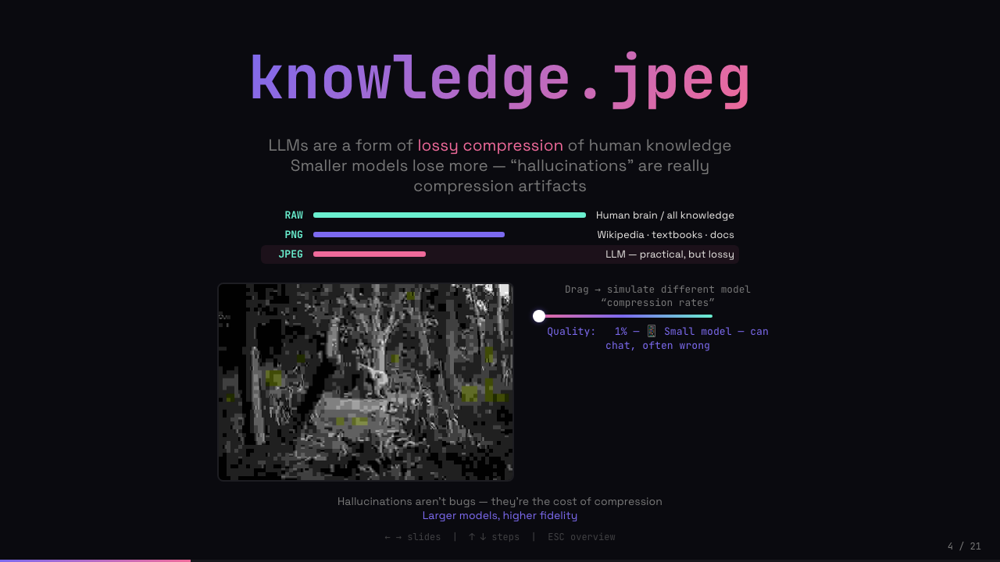
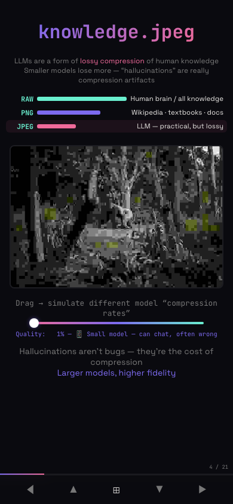

# JPEG demo layout follow-up

Follow-up to [#6](https://github.com/Justineo/working-with-ai/pull/6), merged as
`de084dac076031a1d68143f09e209019f0abccb1`. This keeps the contributor's removal
of overlapping content. [REVIEW_5](REVIEW_5.md), [REVIEW_11](REVIEW_11.md), and
[REVIEW_12](REVIEW_12.md) motivate stable dragging, readable content, and an
undistorted compression preview.

## Reproduced before this change

- At 390 × 844, switching the demo's flex direction to a column made the
  controls' `flex-basis: 320px` a height. About 270px below the Chinese controls
  was blank, pushing the explanation below the viewport.
- At 1280 × 720, the longest English label occupied approximately 425px inside
  a 320px column because wrapping was disabled.
- During WebKit validation, bottom padding on the scrolling flex container did
  not provide scroll clearance above the mobile navigation at 320 × 568.

## Layout decisions

The slide starts at its top padding, with a non-shrinking, parent-constrained
content wrapper. Dynamic text therefore cannot vertically recenter the entire
slide or push its title into an unreachable area above the scroll origin.

The demo uses two explicit grid columns on desktop: a flexible canvas column
capped at 380px and a 320px controls column. At widths up to 768px, it uses one
column capped at 360px. Controls have natural height; labels wrap and the
canvas and slider start positions do not depend on their text. The canvas
fills its grid column and uses its 600 × 400 intrinsic dimensions for sizing.

Bottom clearance belongs to the content wrapper, so WebKit includes it in
scrollable content. Redundant margins were removed to keep the full sequence
comfortable on common desktop screens. Fragment indices, reveal animations,
the compression curve, and keyboard navigation are unchanged.

## Verification (2026-09-28)

The browser matrix covers both `/` and `/en/`, Chromium and WebKit, at:

| Mobile / breakpoint | Desktop / short screens |
| ------------------- | ----------------------- |
| 320 × 568           | 800 × 600               |
| 390 × 844           | 1024 × 600              |
| 767 × 720           | 1280 × 720              |
| 768 × 720           | 1366 × 768              |
| 769 × 720           | 1440 × 900              |

Each case exercises quality 1, 5, 9, 10, 12, 13, 20, 32, 33, 45, 55, 56, 65,
75, 76, 85, 92, 93, 99, and 100: all model descriptions, each transition,
the shortest/longest text, and one-/two-/three-digit values. Checks cover:

- Canvas and slider bounds stay unchanged across quality values.
- Labels, controls, and the slide have no horizontal overflow.
- Canvas content retains the 3:2 ratio, stays inside its parent, and changes
  pixels when the slider is dragged with a real pointer.
- Desktop controls stay 320px wide; mobile controls have content-sized height.
- The title starts inside the scrollable area; the final explanation can be
  scrolled fully above the navigation, including on short screens.
- Initial state and all three fragment stages, advancing to the next slide,
  returning with all fragments visible, stepping backward through fragments,
  and re-entering from the previous slide.
- No uncaught browser errors.

At 390 × 844 in Chromium, the controls now measure about 52px high in Chinese
and 68px in English, rather than 320px. The screenshots show the longest
model description at quality 1 with every fragment visible.

| Chinese                                         | English                                         |
| ----------------------------------------------- | ----------------------------------------------- |
|  |  |
|    |    |

Build: `vp run build` (TypeScript and both language entry points) passes.
`git diff --check` passes. `vp check` reports the same 12 existing files with
formatting issues as the merged baseline. `vp check --no-fmt` reports existing
Node type errors in `vite.config.ts` and an unhandled clipboard Promise warning
in `src/main.ts`; neither file is changed here. `vp test` exits with “No test
files found.” No test framework or dependency was added for this layout change.

To repeat interactively, start `vp dev`, open `/#4` or `/en/#4`, use ↓/↑ for
fragments and →/← for slides, and drag the slider at the sizes above. On short
screens, scroll to both ends to check title and explanation accessibility.
